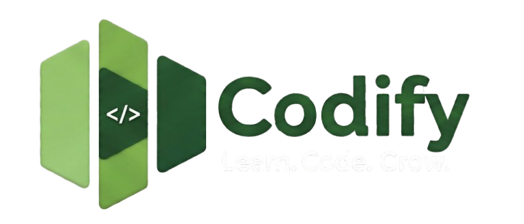

  

# Codify -  Sprint 1
### ➣ Programación Web y Móvil
> El desarrollo de la web está optimizado únicamente para vistas **Desktop**.

Codify es una plataforma web diseñada para facilitar el aprendizaje online mediante clases particulares de programación, conectando a alumnos con tutores especializados de forma directa y eficiente.

## 👥 Integrantes del Grupo
* **Dámaso Guerra, Sergio**
* **Perdomo Hernández, Yaneli**
* **Ramos Quintana, Alba**

---

## Descripción del Proyecto
Codify es un espacio dedicado a la enseñanza personalizada de desarrollo de software. La plataforma cuenta con un sistema de acceso compuesto por **dos formularios** principales: uno de *register* para nuevos usuarios y otro de *login* para usuarios ya existentes.

El sitio dispone de una **parte pública** accesible para cualquier visitante, donde se puede explorar la oferta de contenidos. No obstante, las funcionalidades avanzadas, como el sistema de reserva de clases o el chat privado con profesores, están restringidas y requieren que el usuario esté debidamente autenticado en el sistema.

---

## Requisitos Funcionales
* **RF-01 Registro de Usuario:** Validación de mayoría de edad para el registro.
* **RF-02 Validación de Contraseña:** Sistema de seguridad que exige robustez (Al menos 8 caracteres y un carácter especial).
* **RF-03 Buscador de Profesores:** Filtros avanzados por lenguaje, precio y valoración.
* **RF-04 Sistema de Reservas:** Gestión de disponibilidad y confirmación de citas.
* **RF-05 Chat Privado:** Comunicación directa tras el registro con historial de mensajes.
* **RF-06 Perfil de Usuario:** Gestión de historial de clases y edición de datos personales.

---

## 💻 Mockups y Storyboard
* **Mockups**: El prototipado se ha realizado en la plataforma **Figma**, lo que nos ha permitido definir un diseño moderno y funcional. Todos los detalles, textos e interacciones se encuentran detallados en el archivo **`sprint1-mockups.pdf`**, donde se puede apreciar el diseño con total claridad mediante el uso de zoom.

* **StoryBoard**: Disponible en el archivo **`.mp4`**, donde se explica visualmente la navegabilidad entre páginas y el flujo de experiencia de usuario.

---

## Estrutura de Páginas HTML
El proyecto se compone de **nueve páginas** principales alojadas en la carpeta `/pages`, donde mantienen el nombre de su mockup asociado:

| Página | Descripción |
| :--- | :--- |
| **Home** | Página de inicio, presentación y bienvenida a la plataforma. |
| **Sign In** | Formulario de acceso para usuarios ya registrados. |
| **Sign Up** | Formulario de registro con validaciones de seguridad y edad. |
| **List of Teachers** | Resultados de búsqueda filtrados según el **lenguaje de programación** seleccionado. |
| **Teacher** | Vista con información detallada, experiencia y tarifas del tutor. |
| **Booking** | Interfaz dedicada para la selección de fechas y horarios disponibles. |
| **Chat** | Sistema de mensajería privada (disponible solo para usuarios logueados). |
| **Profile** | Panel de control personal y ajustes de cuenta. |
| **My Bookings** | Sección de gestión de clases donde se pueden visualizar o cancelar las citas. |

---

## 🧩 Templates
Para evitar la duplicidad de código y mejorar la mantenibilidad, hemos extraído las estructuras repetitivas en la carpeta `/templates`. Estos archivos se integran o cargan dinámicamente para mantener una **coherencia visual** en todo el sitio.

Se han identificado **7 componentes característicos** (visibles en la imagen inferior), entre los que destacan:
* **Header:** Barra de navegación consistente con acceso a las secciones principales.
* **Footer:** Pie de página con enlaces de interés, contacto y redes sociales.
* **Layouts reutilizables:** Estructuras de tarjetas y contenedores comunes.

* Los recursos gráficos y fotos de prueba se encuentran organizados en la carpeta `/images`.

---

## Estilo y Apariencia
La organización de los estilos está centralizada en la carpeta `/styles`. 

| Paleta de Colores | Detalles de Diseño |
| :--- | :--- |
|  | <small> Se ha seleccionado una gama de **tonos verdes** para transmitir frescura, aprendizaje y profesionalidad. Esta paleta asegura un contraste óptimo y un **Look & Feel** limpio y moderno, orientado totalmente a mejorar la experiencia de usuario (UX).  • También se ha hecho uso de la metodología **BEM** para obtener un código CSS escalable, legible y organizado por componentes estructurales.</small> |

---

## Lógica y Entorno
El archivo `index.js` gestiona la lógica global de la aplicación, controlando los eventos principales y la interactividad del sitio. Mientras que el `package.json` define las dependencias necesarias para el despliegue y establece el entorno de desarrollo estándar para el proyecto.
